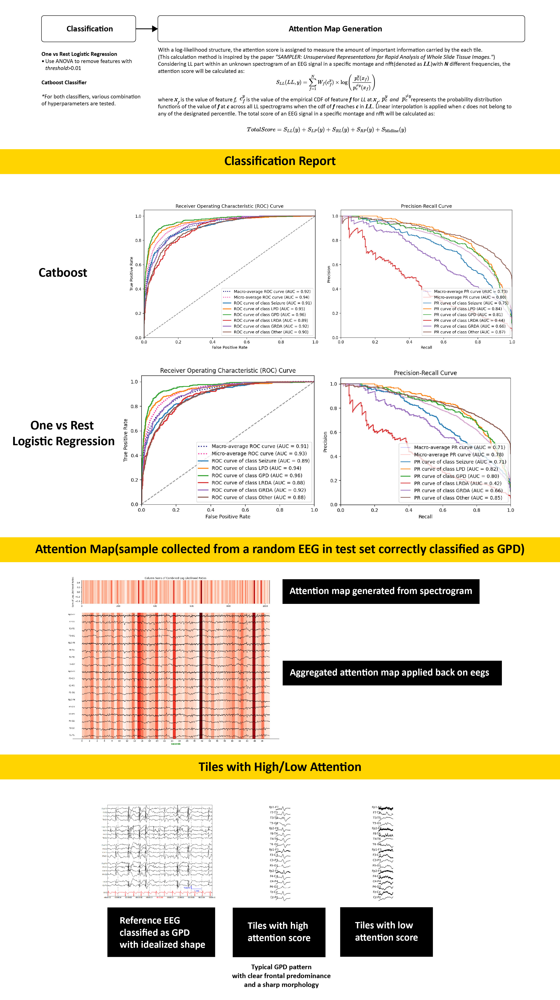

# Statistical Method-Based Interpretative Classification of Harmful Brain Activity

**I extend my gratitude to the authors of the SAMPLER method ([Mukashyaka, Sheridan, Foroughi Pour, & Chuang, 2024](#ref12)). Their original research focused on analyzing breast cancer whole slide images (WSI), and their statistical and distribution-based encoding techniques provided significant inspiration. This led me to adapt and apply similar principles to the processing of time-series data. By employing the cumulative distribution function (CDF) sampling method, can effectively address the unpredictability of pathological feature occurrences and handle noise robustly. The attention map formula mentioned above is also adapted from the SAMPLER method based on a weighted sum of feature likelihoods.**

## Table of Contents
- [Project Overview](#project-overview)
- [Business Understanding](#business-understanding)
- [Data Understanding](#data-understanding)
- [Modeling and Evaluation](#modeling-and-evaluation)
- [Discussion](#discussion)
- [References](#references)

## Project Overview
This project utilizes real-world electroencephalography (EEG) data provided by Harvard Medical School on Kaggle [(Jin et al., 2024)](#ref1), consisting of harmful brain activity in EEG data that needs classification into six types [(Hirsch et al., 2021)](#ref2). The aim is to develop an interpretable model to assist in medical diagnosis. The project achieved the following:
- Achieved a micro-average ROC of 0.94 and a micro-PR AUC of 0.80 on classification.
- Developed an unsupervised logistic regression model capable of directly extracting segments with pathological features.

## Business Understanding
Deep learning has shown significant advancements in medical image and time series analysis. However, the lack of interpretability [(Hatherley, Sparrow, & Howard, 2022)](#ref3), patients' mistrust of AI [(Tyson, Pasquini, Spencer, & Funk, 2023)](#ref4), and the expensive computational resources [(Sarvamangala & Kulkarni, 2022)](#ref5) required for deep learning remain challenges. This project constructed a model that addresses these issues by replacing deep-learning procedures with statistical approaches, reducing computational demands while extracting segments with pathological features and providing more interpretable results, which enhances patient confidence in their results and supports doctors in making more accurate diagnoses.

## Data Understanding
The dataset comprises 17,089 EEG data segments of varying lengths. The official dataset includes 10-minute reference spectrograms, annotated by experts, indicating one or more overlapping 50-second samples for each EEG segment, classified into six categories: seizure (SZ), generalized periodic discharges (GPD), lateralized periodic discharges (LPD), lateralized rhythmic delta activity (LRDA), generalized rhythmic delta activity (GRDA), or “other”. Each spectrogram may contain multiple EEG data segments.

Since the classification is performed on EEG data, and the provided spectrograms were too sparse, resulting in suboptimal performance in initial tests, we decided to use a single sample from each EEG segment and generate custom spectrograms for analysis. The spectrograms were generated by a modified version of Chris Deotte's code [(Deotte, 2024)](#ref6).

To capture representative EEG patterns([Hirsch et al., 2021](#ref2);  [Georgieva, Milanova, & Kasabov, 2014](#ref7); [Atkinson, 2010](#ref8)), which typically occur in the LL, RL, LP, RP, and midline areas of the brain, the samples were subjected to two types of montage [(Choi, Co, & Akireddy, 2020)](#ref9) (transverse bipolar montage and longitudinal bipolar montage). Inspired by Multi-scale Tiling in Multiple Instance Learning (MIL) ([Ilse, Tomczak, & Welling, 2018](#ref10); [D'Amato, Szostak, & Torben-Nielsen, 2022](#ref11)), during the Short-Time Fourier Transform (STFT) phase of converting EEG signals to spectrograms, we applied multiscale windowing (data points = 128, 256, 512) to the EEG signals of different montages. Using a constant length of the windowed signal of 512, each EEG sample was transformed into a spectrogram, and features were encoded based on feature distributions ([Mukashyaka, Sheridan, Foroughi Pour, & Chuang, 2024](#ref12)).

## Modeling and Evaluation

## Discussion
The model constructed in this project demonstrates relatively accurate category predictions. However, the KL divergence between the predicted and true category probabilities is still inferior to that achieved by deep learning models. I believe that while deep learning techniques will inevitably take over some traditional machine learning tasks, encoding methods based on statistics and distributions remain worthy of exploration. Even with simple and effective methods, we have achieved promising results. Therefore, future research should continue to focus on combining statistical mathematical methods with deep learning techniques.

In the Kaggle competition, many participants achieved remarkable results by using convolutional networks (CNNs) and VITs for feature extraction. During my conversation with the authors of the influential paper "SAMPLER: Empirical Distribution Representations for Rapid Analysis of Whole Slide Tissue Images," I learned that there is a linear correlation between DL features extracted using CNNs and interpretable morphologies in histological slides ([Foroughi Pour, White, Park, et al., 2022](#ref13)). 

The question remains whether similar phenomena exist in EEG data. If they do, what aspects of EEG morphologies can DL features represent? To explore these questions, future research will utilize datasets that include additional information with interpretable morphologies and focus on the relationship between these morphological features and the different features extracted by deep learning models.

## References

1.  Jin, J., Lin, Z., Yang, C., Chow, A., Dane, S., Sun, J., & Westover, M. B. (2024). *HMS - Harmful Brain Activity Classification*. Kaggle. https://kaggle.com/competitions/hms-harmful-brain-activity-classification

2. Hirsch, L. J., Fong, M. W. K., Leitinger, M., LaRoche, S. M., Beniczky, S., Abend, N. S., Lee, J. W., Wusthoff, C. J., Hahn, C. D., Westover, M. B., Gerard, E. E., Herman, S. T., Haider, H. A., Osman, G., Rodriguez-Ruiz, A., Maciel, C. B., Gilmore, E. J., Fernandez, A., Rosenthal, E. S., Claassen, J., … Gaspard, N. (2021). American Clinical Neurophysiology Society's Standardized Critical Care EEG Terminology: 2021 Version. Journal of clinical neurophysiology : official publication of the American Electroencephalographic Society, 38(1), 1–29. https://doi.org/10.1097/WNP.0000000000000806

3. Hatherley, J., Sparrow, R., & Howard, M. (2022). *The Virtues of Interpretable Medical Artificial Intelligence*. Cambridge Quarterly of Healthcare Ethics, 1–10. doi:10.1017/S0963180122000305

4. Tyson, A., Pasquini, G., Spencer, A., & Funk, C. (2023). *60% of Americans Would Be Uncomfortable With Provider Relying on AI in Their Own Health Care*. Pew Research Center Science & Society. https://www.pewresearch.org/science/2023/02/22/60-of-americans-would-be-uncomfortable-with-provider-relying-on-ai-in-their-own-health-care

5. Sarvamangala, D. R., & Kulkarni, R. V. (2022). *Convolutional neural networks in medical image understanding: a survey*. Evolutionary intelligence, 15(1), 1–22. https://doi.org/10.1007/s12065-020-00540-3

6.  Deotte, C. (2024). *How To Make Spectrogram from EEG*. Kaggle.com. https://www.kaggle.com/code/cdeotte/how-to-make-spectrogram-from-eeg

7. Georgieva, P., Milanova, M., & Kasabov, N. (2014). EEG signal processing for brain–computer interfaces. In Springer Handbook of Bio-/Neuroinformatics (pp. 797-812). Springer. https://doi.org/10.1007/978-3-642-30574-0_46

8. Atkinson, M. (2010). *How to interpret an EEG and its report*. Wayne State University. https://neurology.med.wayne.edu/pdfs/how_to_interpret_and_eeg_and_its_report.pdf

9. Choi, C., Co, J., & Akireddy, N. (2020). *Developing and Testing New Montage Methods in Electroencephalography*. https://theinformaticists.com/2020/08/25/developing-and-testing-new-montage-methods-in-electroencephalography/

10. Ilse, M., Tomczak, J. M., & Welling, M. (2018). *Attention-based Deep Multiple Instance Learning*. ArXiv. https://arxiv.org/abs/1802.04712

11. D'Amato, M., Szostak, P., & Torben-Nielsen, B. (2022). *A comparison between single-and multi-scale approaches for classification of histopathology images*. Frontiers in public health, 10, 892658.

12. Mukashyaka, P., Sheridan, T. B., Foroughi Pour, A., & Chuang, J. H. (2024). *SAMPLER: unsupervised representations for rapid analysis of whole slide tissue images*. EBioMedicine, 99, 104908. https://doi.org/10.1016/j.ebiom.2023.104908 

13. Foroughi Pour, A., White, B. S., Park, J., et al. (2022). *Deep learning features encode interpretable morphologies within histological images*. Scientific Reports, 12, 9428. https://doi.org/10.1038/s41598-022-13541-2
